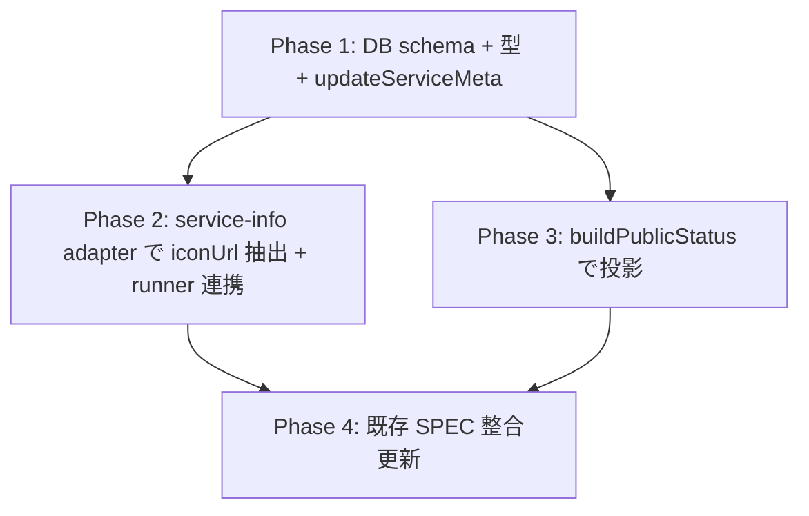

# _shared/types 変更計画書（favicon-projection）

> **入力**: `./001_REVISE_SPEC.md`, `../../concept.md` §1.4, Step 2 Read で確認した実装 (src/types/, src/db/, src/providers/, src/features/public-status/, src/registry/ + bousai-bag-checker 連動 PJ の現状)
> **最終更新**: 2026-05-28

---

## 1. 既存ファイル変更一覧

| ファイル | 変更内容（概要） | リスク | 関連 SPEC § |
|---|---|---|---|
| `src/types/service.ts` | (1) `ServiceInfoResponse` に `iconUrl?: string` 追加 (JSDoc に v2 schemaVersion bump 説明) (2) `ServiceDescriptor` に `iconUrl?: string` 追加 (3) **`ServiceMeta` 型を新設**: `interface ServiceMeta { iconUrl?: string }` (将来 last_deploy_at 等の他 producer 申告メタ用に拡張可能) (4) **`ProviderAdapter` 戻り値型を拡張**: `collect: (svc) => Promise<{metrics: UsageMetric[]; error?: string; meta?: ServiceMeta}>` (meta?: optional のため ping/vercel/neon 既存 adapter は変更不要) | 低 (additive 型 + ProviderAdapter optional 拡張) | §7.2, §7.3 <!-- spec-review R1: ProviderAdapter 拡張 (a) 案 --> |
| `src/types/index.ts` | re-export 変更なし (既に service.ts 全 export) | 無 | - |
| `src/db/schema.ts` | `services` テーブルに `iconUrl: text("icon_url")` カラム追加 (nullable) | 低 (DB schema 追加、migration で適用) | §7.3 |
| `src/db/queries.ts` | (1) `toServiceDescriptor` に `iconUrl: r.iconUrl ?? undefined` 追加 (2) `upsertService` は iconUrl 経路を**意図的に追加しない** (admin write からは設定不可、SoT 衝突防止) — `serviceInfo` と同列に追加してしまわないよう注意 (3) 新規 `updateServiceMeta(db, slug, {iconUrl})` 関数追加 — `services.icon_url` のみを update | 中 (admin 経路で誤って iconUrl を上書きしないことを test で担保) | §7.3, §7.4 |
| `src/providers/adapters.ts` | (1) `createServiceInfoAdapter` で ServiceInfoResponse から iconUrl 抽出 + format check (新 `isSafePublicUrl` で SSRF 予防) + 失敗時 `console.warn('service-info iconUrl rejected: slug=X reason=Y')` (rejection 理由のメタ情報のみ、値はログしない) (2) wrap ヘルパの戻り値型 `CollectResult` に `meta?: ServiceMeta` 追加 (3) service-info adapter のみ meta を返却、ping/vercel/neon は meta 返さず undefined のまま (TS optional で互換) | **中** (CollectResult 型に meta?: 追加で ping/vercel/neon の wrap 戻り値型も変わるが、optional のため実装変更不要。runner.ts 1 行追加) | §7.1 SI-UC2 <!-- spec-review R1: ProviderAdapter 拡張 (a) 案 + R6: stderr 警告ログ --> |
| `src/registry/schema.ts` | (1) `serviceDescriptorSchema` に iconUrl は**追加しない** (admin write 経路では受け付けない、SoT 一貫性 — stripUnknown で req.body.iconUrl は除去される) (2) internal const `publicUrl` を `src/lib/safeUrl.ts` の `isSafePublicUrl` 経由に置換 (zod refinement 内で `(u) => isSafePublicUrl(u)`) — SSRF 予防ロジックの単一 SoT 化 | 低 (refactor、挙動同等) | §3 影響範囲 + 002 §2 新規 <!-- spec-review R2 (zod 不含維持) + R3 (publicUrl 共通化) --> |
| `src/registry/validate.ts` | **変更なし** — `r.data as ServiceDescriptor` キャストの挙動 (iconUrl=undefined を許容) を JSDoc に明示する 1 行のみ追記推奨 | 無 | §3 + 001 §7.3 <!-- spec-review R2: キャスト挙動明示 --> |
| `src/features/public-status/buildPublicStatus.ts` | DTO build 部の `out: PublicServiceStatus = {slug, name, url, status}` に `if (svc.iconUrl) out.iconUrl = svc.iconUrl;` 追加 | 低 (1 行追加) | §7.2 |
| `src/features/public-status/buildPublicStatus.test.ts` | iconUrl 投影テスト追加 + 内部キー非含有テストの allowlist に iconUrl 追加 | 低 | 003_UNIT_TEST §1.1 |
| `src/types/types.test.ts` | ServiceInfoResponse v2 型テストに iconUrl 含むケース追加 (v1 互換も維持) | 低 | 003_UNIT_TEST §1.1 |
| `src/db/services.test.ts` | services テーブル round-trip テストに iconUrl 含むケース追加 + admin write 経路で iconUrl を渡しても無視される (or schema 検証で拒否される) ことを assert | 中 | 003_UNIT_TEST §1.3 |
| `src/providers/adapters.test.ts` | service-info adapter テストに iconUrl 抽出ケース + format check (https / 1024 / 内部アドレス) ケース追加 | 中 | 003_UNIT_TEST §1.1, §1.2 |
| `src/features/collection/runner.ts` | adapter.collect の戻り値 `res.meta` を確認し、`res.meta?.iconUrl` があれば `await deps.updateServiceMeta(svc.slug, {iconUrl: res.meta.iconUrl})` を呼び出す 1 行追加。RunnerDeps に `updateServiceMeta?: (slug: string, meta: ServiceMeta) => Promise<void>` を optional として追加 (テストでは mock 注入、本番では api/cron/collect.ts で渡す) | 低 (1 行追加 + Deps interface optional 拡張) | §7.1 SI-UC2 <!-- spec-review R1: runner で副作用集約、adapter は純粋 --> |
| `src/features/collection/*.test.ts` | runner テストに meta 経路追加 | 低 | 003_UNIT_TEST §4 |
| `api/public/status.ts` | **変更なし** (DTO 拡張は型レベルで吸収、handler ロジック不変) | 無 | §3 影響範囲 |
| `api/cron/collect.ts` | **変更なし** (既存 cron path で service-info adapter が自動的に iconUrl 更新) | 無 | §3 影響範囲 |
| `docs/_shared/types/001_types_SPEC.md` | §1.2 ServiceInfoResponse の schemaVersion を「v1 (legacy) / v2 (current)」に annotate、iconUrl?: string を追加。§1.2 ServiceDescriptor に iconUrl 追加。§8 未決事項に解決済 [論点-T1] を維持、新規 [論点-T2] = v1/v2 受信ロジックを追加 (本 revise SPEC を参照) | 低 | §2.1, §7.2 |
| `docs/_shared/auth/001_auth_SPEC.md` | public-status DTO の表に iconUrl 追加 (本 revise から参照) | 低 | §2.2 |

## 2. 新規ファイル一覧

| ファイル | 責務 | 依存 | LOC 見積 |
|---|---|---|---|
| `drizzle/<NNNN>_add_services_icon_url.sql` (migration) | `ALTER TABLE services ADD COLUMN icon_url text;` (rollback は forward migration として `DROP COLUMN icon_url;` を別 SQL で apply、詳細 005 §3) | drizzle-kit migration system | ~5 |
| **`src/lib/safeUrl.ts`** (新規) | `isSafePublicUrl(s: unknown, opts?: {maxLength?: number}): boolean` 純関数 — URL parse + https only + internal アドレス拒否 (registry/schema.ts の publicUrl ロジックを export 形で共通化) | (なし、純粋関数) | ~30 <!-- spec-review R3: P19/P3 違反回避、SSRF 予防 SoT 単一化 --> |
| **`src/lib/safeUrl.test.ts`** (新規) | isSafePublicUrl テスト (URL/https/internal/protocol/length/non-string/empty を 100% カバー、registry 既存テストと adapter 新規テストの両方が参照する SoT) | vitest | ~80 <!-- spec-review R3 --> |
| `src/db/serviceMeta.ts` (or queries.ts に追記) | `updateServiceMeta(db, slug, meta: ServiceMeta)` 純関数 — meta.iconUrl があれば `services.icon_url` を update + updatedAt 更新、iconUrl=undefined or no key なら no-op (保持セマンティクス, [論点-FP2]) | drizzle | ~30 |
| `src/db/serviceMeta.test.ts` (or queries.test.ts に追記) | updateServiceMeta テスト (set / no-op / 存在しない slug → no-op / 既存値保持) | testdb | ~50 |

## 3. 削除ファイル一覧

| ファイル | 削除理由 | 代替 |
|---|---|---|
| (なし) | additive 改修のため削除なし | - |

## 4. マイグレーション要否

- DB スキーマ変更: ✅ **必要** (`services.icon_url text` 追加、詳細は 005_REVISE_MIGRATION.md)
- 既存データ変換: ❌ 不要 (新規 nullable カラム、既存行は NULL でデフォルト)
- 設定ファイル変更: ❌ 不要
- ストレージパス変更: ❌ 不要

## 5. 実装 Phase 分割（`/flow:tdd-phase` 連携）

### Phase 1: safeUrl 共通化 + DB schema + 型拡張 (RED→GREEN→IMPROVE) <!-- spec-review R3: safeUrl 先行 + R1: ServiceMeta/ProviderAdapter 拡張 -->
- **対象**: **`src/lib/safeUrl.ts` (新規)** + `src/types/service.ts` (+ ServiceMeta 型 + ProviderAdapter 拡張) + `src/db/schema.ts` + drizzle migration + `src/db/queries.ts` (`toServiceDescriptor` 拡張 + `updateServiceMeta` 新設) + `src/registry/schema.ts` (publicUrl を safeUrl に置換)
- **ゴール**:
  - `isSafePublicUrl` 実装 + テスト 100% カバレッジ (https/internal/protocol/length/non-string/empty)
  - registry/schema.ts の publicUrl を safeUrl 経由に置換 (既存テスト green 維持で挙動同等を保証)
  - ServiceInfoResponse + ServiceDescriptor 型に iconUrl 追加、**ServiceMeta 型新設**、**ProviderAdapter 戻り値型に meta?: ServiceMeta 追加** (型テスト green、ping/vercel/neon は変更不要で互換確認)
  - services テーブル + drizzle migration 追加 (migration apply → カラム存在確認)
  - `updateServiceMeta(db, slug, {iconUrl})` 実装 + テスト (set / no-op / 既存値保持 / 存在しない slug = no-op)
  - `toServiceDescriptor` に iconUrl 反映 (round-trip テスト green)
  - **admin write 経路 (`upsertService`) では iconUrl を受け付けない** ことを test で assert (SoT 一貫性、FP-U-26)

### Phase 2: service-info adapter で iconUrl 抽出 + runner 連携 (RED→GREEN→IMPROVE) <!-- spec-review R1, R3, R6 -->
- **対象**: `src/providers/adapters.ts` + `src/providers/adapters.test.ts` + `src/features/collection/runner.ts` + `api/cron/collect.ts` (RunnerDeps.updateServiceMeta 配線)
- **ゴール**:
  - `createServiceInfoAdapter` が ServiceInfoResponse から iconUrl 抽出 (v1/v2 両対応、optional)
  - format check: **Phase 1 で共通化済 `isSafePublicUrl` を呼び出す** (再実装しない、R3 違反防止)
  - **format check fail 時に `console.warn('service-info iconUrl rejected: slug=<slug> reason=<protocol|length|internal|parse|empty> rawType=<typeof>')` を出力** (値はログしない、rejection 理由のメタ情報のみ、R6)
  - adapter 戻り値に `meta?: ServiceMeta` を含める (CollectResult 型拡張、ping/vercel/neon は影響なし)
  - runner.ts で `res.meta?.iconUrl` があれば `await deps.updateServiceMeta(svc.slug, res.meta)` 呼び出し (1 行追加、副作用集約)
  - api/cron/collect.ts で `RunnerDeps.updateServiceMeta` に `(slug, meta) => updateServiceMeta(db, slug, meta)` を渡す
  - テスト: adapter 正常 / iconUrl 無し / http / 内部アドレス / 1024 超 / 空文字 / non-string + **stderr 警告ログ出力** (vi.spyOn(console, 'warn')) + runner meta 経路 (mock updateServiceMeta が iconUrl 受信時のみ呼ばれる)

### Phase 3: public-status DTO 投影 (RED→GREEN→IMPROVE)
- **対象**: `src/features/public-status/buildPublicStatus.ts` + `buildPublicStatus.test.ts`
- **ゴール**:
  - `PublicServiceStatus` 型に iconUrl 追加 (型は Phase 1 で対応済)
  - `buildPublicStatus` で `svc.iconUrl` を DTO に投影 (有/無テスト)
  - 既存 「内部キー非含有」テストの allowlist に iconUrl を加える (revenue 等は引き続き禁止のまま)

### Phase 4: 設計文書 + 整合性確認 (IMPROVE 系統)
- **対象**: `docs/_shared/types/001_types_SPEC.md` (§1.2 contract annotate)、`docs/_shared/auth/001_auth_SPEC.md` (DTO 表更新)
- **ゴール**: 既存設計文書を本 revise SPEC と整合させる (drift 防止)

## 6. 依存関係順序

Phase 2 と Phase 3 は型 (Phase 1) 完了後に並行可能。ただし `/flow:tdd` の単一スレッド実行では Phase 1 → 2 → 3 → 4 の順で進める。

## 7. ロールアウト計画

| ステップ | 内容 | 期日 | 検証方法 |
|---|---|---|---|
| RO-1 | service-hub Phase 1-4 実装 (本 PJ) + tdd green | 本セッション後 (次セッションで /flow:tdd 起動) | unit test green + 既存 e2e green |
| RO-2 | drizzle migration 本番適用 (`scripts/with-env.sh drizzle-kit migrate`) | RO-1 同時 | `\d services` で icon_url 列確認 |
| RO-3 | service-hub deploy (vercel production) | RO-1 直後 | `/api/public/status` 200 + iconUrl optional 含む (NULL 状態) |
| RO-4 | bousai-bag-checker で同 slug `favicon-projection` の連動 revise + tdd + deploy (producer 側) | 次々セッション (1-3 日後想定) | bousai-bag-checker `/api/hub/service-info` レスポンスに iconUrl: 'https://.../favicon.svg' 含む |
| RO-5 | service-hub cron collect 翌日実行 → services.icon_url 更新確認 | RO-4 翌日 | DB `select slug, icon_url from services` + `/api/public/status` に iconUrl 反映 |
| RO-6 | shipyard で iconUrl 利用 + fallback 実装 (shipyard PJ の責務、本 revise の責務外) | shipyard リリース時 | shipyard 一覧画面で各 service のアイコン表示 + 未対応 service は fallback アイコン |
| RO-7 | 将来登録 producer 全てが v2 contract 対応 | 継続 | 新規登録時の onboard checklist に「iconUrl 申告」追加 (perspectives O48 更新、[論点-FP1]) |

**フィーチャーフラグ**: 不要 (additive 後方互換、段階的 producer 対応)

## 8. リスク・注意点

- **runner 型変更の波及** (spec-review R1 で解決): adapter 戻り値型 `{metrics, meta?}` 拡張で `src/features/collection/runner.ts` の型シグネチャに optional `meta?: ServiceMeta` 追加。ping/vercel/neon は meta 返却なしで undefined のまま (TS optional で互換) → runner で `if (res.meta?.iconUrl) await deps.updateServiceMeta(...)` の 1 行分岐で集約。RunnerDeps に `updateServiceMeta?` optional 追加、テストでは mock 注入
- **SoT 衝突防止** (spec-review R2 で二重防御化): `services.icon_url` を admin write からも update できる状態にすると、producer 申告と admin 編集が衝突する。本 PLAN では admin write 経路に iconUrl を**意図的に追加しない** + **`upsertService` SET 句に iconUrl を含めない** + **テストで `upsertService(svc with iconUrl)` を呼んでも iconUrl が無視されることを assert (FP-U-26)** の 3 層防御
- **format check の SSRF 予防** (spec-review R3 で解決): Phase 1 で `src/lib/safeUrl.ts` を新設し registry/schema.ts と adapters.ts の両方が `isSafePublicUrl` を import (SoT 単一化)。再実装ゼロ
- **migration rollback の安全性**: `DROP COLUMN icon_url` は受信値を失うが、producer から再取得可能なため**永続損失なし**。drizzle-kit の rollback は forward migration として手動 SQL ファイル作成 (詳細 005 §3、spec-review R8)
- **連動 PJ タイミング** (spec-review R5 で P52 観点追加): bousai-bag-checker 側の revise を忘れると一時的に iconUrl 空のままだが、後方互換のため UI は fallback で動く (リスク小)。**ただし producer 既存テストで `schemaVersion === 1` を assert している箇所 (P52 観点) を `grep schemaVersion.*1` で全列挙必須** (連動 revise SPEC 段階で)
- **CF-20260528-016 (本 PJ 検知)**: flow:revise §Step 3.1 に「対外契約変更フラグ」項目化が未済。本 PJ では人為的に補完運用、flow-suite 側 commit はユーザー手動

## 9. 完了の定義 (DoD)

- [ ] Phase 1-4 完了
- [ ] 単体テストカバレッジ目標達成 (行 80% / 分岐 70% 継承)
- [ ] E2E シナリオ全成功 (004_REVISE_E2E_TEST.md §1, §2)
- [ ] drizzle migration apply 検証完了 (`scripts/with-env.sh drizzle-kit migrate` + `\d services` 確認)
- [ ] `/flow:spec-review` 通過 (対外契約変更のため特に推奨)
- [ ] `api/public/status` レスポンスに iconUrl optional が含まれる (NULL 状態で 200)
- [ ] admin write 経路で iconUrl を上書きできないことの test assert
- [ ] 連動 PJ bousai-bag-checker の revise dispatch リマインダ完了 (完了サマリ §10 で明示)

## 10. 更新履歴

| 日付 | 変更概要 | 実行者 |
|---|---|---|
| 2026-05-28 | 初版作成 (Phase 1-4 + DB migration + runner 型変更 + SoT 一貫性配慮 + 連動 PJ ロールアウト計画) | /flow:revise |
