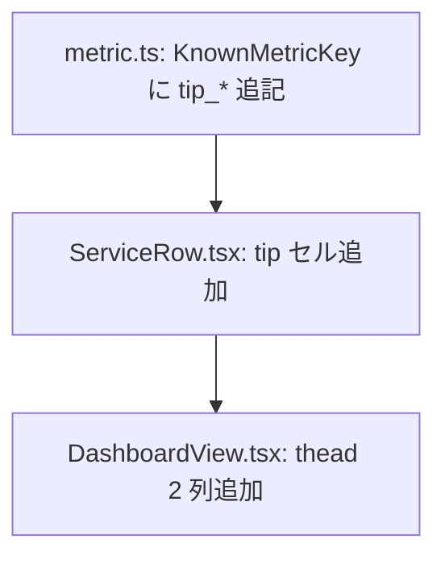

# dashboard 変更計画書（投げ銭(tip)指標を一覧に表示）

> **入力**: `./001_REVISE_SPEC.md`, `../../concept.md`, Step 2 で読んだ既存実装
> **最終更新**: 2026-06-07

---

## 1. 既存ファイル変更一覧

| ファイル | 変更内容（概要） | リスク | 関連 SPEC § |
|---|---|---|---|
| `src/features/dashboard/ServiceRow.tsx` | 末尾に tip 2 セル追加。`yen()` ヘルパで `¥{value}`、未申告は `—`、0 は有効値。`data-tip-count` / `data-tip-yen` 属性付与 | 低（additive、既存セル不変） | §2.2 / §7.1 |
| `src/features/dashboard/DashboardView.tsx` | thead に `<th>投げ銭</th><th>投げ銭(¥)</th>` を末尾追加 | 低（見出しのみ） | §2.2 |
| `src/types/metric.ts` | `KnownMetricKey` に `tip_count` / `tip_total_yen` を追記（任意・推奨、open union で後方互換） | なし | §2.3 |

## 2. 新規ファイル一覧
（なし）

## 3. 削除ファイル一覧
（なし）

## 4. マイグレーション要否

- DB スキーマ変更: ❌（usage_snapshots は open union で tip_* 保存済）
- 既存データ変換: ❌
- 設定ファイル変更: ❌
- ストレージパス変更: ❌

→ **MIGRATION (Phase 5) 不要**。

## 5. 実装 Phase 分割（`/dev-tdd-phase` 連携）

### Phase 1 (RED→GREEN→IMPROVE): tip 列表示
- 対象: `ServiceRow.tsx`（tip 2 セル + `yen()` ヘルパ + 未申告/0 判定）、`DashboardView.tsx`（thead 2 列）、`metric.ts`（KnownMetricKey 追記）
- ゴール: tip 申告ありで `¥100` / `1`、未申告で `—`、0 で `¥0` / `0` を表示。既存 8 セルはリグレッションなし。

## 6. 依存関係順序

## 7. ロールアウト計画

| ステップ | 内容 | 期日 | 検証方法 |
|---|---|---|---|
| 1 | unit GREEN | 2026-06-07 | vitest（ServiceRow.test / summary.test） |
| 2 | E2E（任意・headless） | 2026-06-07 | dashboard 一覧に tip 列が出ることを確認 |
| 3 | 本番デプロイ（一括） | release gate | デプロイ後 bousai-bag-checker 行に ¥100 / 1 を目視 |

## 8. リスク・注意点

- 横幅: 列が 8→10 に増える。compact 行のはみ出しがないか視覚確認（design-system 一覧性）。
- i18n/コピー: 「投げ銭」見出し・`¥` 接頭はユーザー向け文言。design-system ボイス & O38 準拠でレビュー。
- `tip_count` の 0 は有効値（last_deploy_at の 0=欠落とは扱いが異なる）。未申告(`undefined`)のみ `—`。

## 9. 完了の定義 (DoD)

- [ ] tip 申告あり → `¥{value}` / 件数表示、未申告 → `—`、0 → `¥0`/`0`
- [ ] 既存 8 セルのリグレッションテスト GREEN
- [ ] thead 列数とセル数が一致（10 列）
- [ ] 単体テストカバレッジ目標達成（既存継承）
- [ ] `KnownMetricKey` に tip_* 追記（型エラーなし）

## 10. 更新履歴
| 日付 | 変更概要 | 実行者 |
|---|---|---|
| 2026-06-07 | 初版作成 | /flow:revise |
