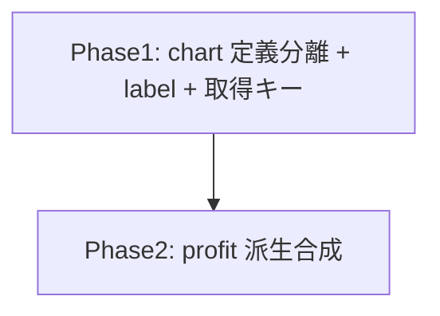

# dashboard 変更計画書（上部チャートをビジネス指標化）

> **入力**: `./001_REVISE_SPEC.md`, `../../concept.md`, Step 2 で読んだ既存実装
> **最終更新**: 2026-05-30

---

## 1. 既存ファイル変更一覧

| ファイル | 変更内容（概要） | リスク | 関連 SPEC § |
|---|---|---|---|
| `src/features/dashboard/summary.ts` | (1) `DASHBOARD_CHART_METRICS`(取得+定義兼用) を **`DASHBOARD_CHART_SOURCE_METRICS = ["mau","revenue_month_usd","ai_cost_month_usd"]`**(取得) と **`DASHBOARD_CHARTS`**(4 定義: {metricKey,label,unit,derived?}) に分離。(2) `DashboardChart` 型に `label: string` 追加。(3) `buildCharts` を chart 定義駆動に改修 + **profit 派生系列の合成**(revenue−cost を capturedAt で整合)。 | 中 | §2.1,§2.2,§7.2 |
| `src/components/MetricChart.tsx` | `label?: string` prop 追加。見出し `{metricKey} ({unit})` → `{label ?? metricKey} ({unit})`（label optional で service-detail 後方互換）。testid は `chart-${metricKey}` 維持。 | 低 | §2.2,§7.3 |
| `src/features/dashboard/DashboardCharts.tsx` | `MetricChart` に `label={chart.label}` を渡す。JSDoc を 4 ビジネス chart に更新。 | 低 | §2.1 |
| `api/dashboard/summary.ts` | `recentSnapshots(db, sinceIso, [...DASHBOARD_CHART_SOURCE_METRICS])` に変更（取得キー = mau/revenue/cost）。コメント更新。 | 低 | §2.2 |
| `src/features/dashboard/profitability.ts` | (論点-001 採用時) `profitAt(revenue, cost)` 純関数を export し computeProfitability から再利用（採算定義 SoT 化）。 | 低 | §7.5,§9 |

## 2. 新規ファイル一覧
| ファイル | 責務 | 依存 | LOC 見積 |
|---|---|---|---|
| （なし。chart 定義 + 派生は summary.ts 内に集約） | — | — | — |

> profit 派生・chart 定義は既存 summary.ts に閉じる。新規ファイル不要。

## 3. 削除ファイル一覧
| ファイル | 削除理由 | 代替 |
|---|---|---|
| （なし。up/db_storage_bytes は collect・一覧で使うため削除せず chart 定義から外すのみ） | — | — |

## 4. マイグレーション要否
- DB スキーマ変更: ❌
- 既存データ変換: ❌
- 設定ファイル変更: ❌
- ストレージパス変更: ❌

→ **MIGRATION 不要**（005 生成しない）。revenue/cost は business-observability で既収集。

## 5. 実装 Phase 分割（`/flow:tdd-phase` 連携）

### Phase 1: chart 定義の分離 + ラベル + 取得キー変更（RED→GREEN→IMPROVE）
- 対象: `summary.ts`（SOURCE_METRICS + DASHBOARD_CHARTS + label）, `MetricChart.tsx`（label prop）, `DashboardCharts.tsx`（label 渡し）, `api/dashboard/summary.ts`（取得キー）
- ゴール: charts が mau/revenue/cost/(profit 仮: 空でも 4 件) を label 付きで返す。MetricChart が日本語見出し表示。up/db_storage_bytes chart が消える。

### Phase 2: 採算(profit)派生系列の合成（RED→GREEN→IMPROVE）
- 対象: `summary.ts buildCharts`（profit 派生）, `profitability.ts`（profitAt 純関数、論点-001 採用時）
- ゴール: buildCharts が各 service の revenue/cost から profit(t)=revenue(t)−(cost(t)??0) 系列を合成。revenue 無し時点は profit 点なし、cost 欠落は 0。

## 6. 依存関係順序

Phase 1（構造）→ Phase 2（派生ロジック）の順。

## 7. ロールアウト計画
| ステップ | 内容 | 期日 | 検証方法 |
|---|---|---|---|
| 1 | 実装 + unit green | 2026-05-30 | `npm test` |
| 2 | spec-review | 実装前 | `/flow:spec-review dashboard` |
| 3 | E2E + 視覚確認 | 実装後 | `/flow:e2e` + headless |
| 4 | デプロイ（10th） | 次回 | post-deploy smoke |

## 8. リスク・注意点
- **MetricChart の後方互換**: label を optional にしないと service-detail（label 未指定）が壊れる。必ず `label?` + fallback。
- **profit 系列の capturedAt 整合**: revenue と cost のスナップショットが同 capturedAt で揃う前提（同一 collection run で自己申告）。ずれる場合は revenue の capturedAt 基準で cost を lookup（無ければ 0）。テストで両ケース確認。
- **採算定義の二重化**: 論点-001（profitAt 共通化）で SoT 一本化を推奨。
- **テスト**: summary.test の charts 件数/順序/metricKey アサーション、DashboardCharts.test の chart-up/db_storage_bytes 除去 + chart-revenue_month_usd/ai_cost_month_usd/profit 追加 + label 検証、MetricChart.test の label prop、DashboardView.test の charts helper を 4 ビジネス chart に。

## 9. 完了の定義 (DoD)
- [ ] Phase 1-2 完了
- [ ] charts = 4 件（mau/revenue/cost/profit）、上から固定順、label 日本語
- [ ] profit 派生系列が revenue−cost で算出、revenue 無し時点は点なし
- [ ] up/db_storage_bytes が chart から消える（一覧 status 列・収集は不変）
- [ ] MetricChart label optional で service-detail 不破壊
- [ ] 単体テスト green（修正 + 新規）
- [ ] spec-review / E2E green

## 10. 更新履歴
| 日付 | 変更概要 | 実行者 |
|---|---|---|
| 2026-05-30 | 初版作成 | /flow:revise |
