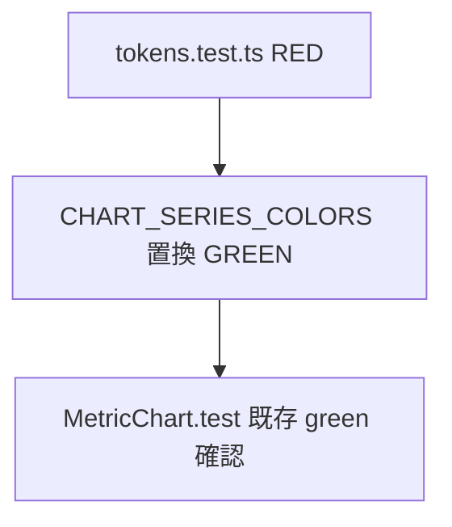

# dashboard 変更計画書（chart 線色パレットのバリエーション拡充）

> **入力**: `./001_REVISE_SPEC.md`, `../../concept.md`, Step 2 で読んだ実装 (tokens.ts / MetricChart.tsx)
> **最終更新**: 2026-06-08

---

## 1. 既存ファイル変更一覧

| ファイル | 変更内容（概要） | リスク | 関連 SPEC § |
|---|---|---|---|
| `src/components/tokens.ts` | `CHART_SERIES_COLORS` 配列を暖寒交互順に並べ替え、idx1 を `#34d3a0`→`#22d3ee`、idx7 を `#ec4899`(ピンク)→末尾の紫 `#a78bfa` へ再構成。コメント（色相環説明）も新方針へ更新 | 低（純データ） | §7.5 |

## 2. 新規ファイル一覧

| ファイル | 責務 | 依存 | LOC 見積 |
|---|---|---|---|
| `src/components/tokens.test.ts` | パレット不変条件を固定（8 色 / 重複なし / `chartSeriesColor` 循環 / idx0=青据置） | tokens.ts | ~40 |

## 3. 削除ファイル一覧

| ファイル | 削除理由 | 代替 |
|---|---|---|
| （なし） | — | — |

## 4. マイグレーション要否

- DB スキーマ変更: ❌
- 既存データ変換: ❌
- 設定ファイル変更: ❌
- ストレージパス変更: ❌

→ **マイグレーション不要**（純視覚変更）。

## 5. 実装 Phase 分割（`/flow:tdd` 連携）

### Phase 1 (RED→GREEN→IMPROVE)
- 対象: `tokens.ts` パレット再構成 + `tokens.test.ts` 新規
- ゴール:
  - RED: `tokens.test.ts` を先に書く（新パレット順 / 重複なし / 8 色 / 循環）
  - GREEN: `CHART_SERIES_COLORS` を新パレットに置換
  - IMPROVE: コメント整理、既存 `MetricChart.test.tsx` の全 green を確認

## 6. 依存関係順序

## 7. ロールアウト計画

| ステップ | 内容 | 期日 | 検証方法 |
|---|---|---|---|
| 1 | 単体 green | 2026-06-08 | `tokens.test.ts` + `MetricChart.test.tsx` |
| 2 | E2E green（リグレッション） | 2026-06-08 | dashboard chart 描画・凡例の維持 |
| 3 | 一括デプロイ同梱 | 次回 deploy | 実機で 2〜3 service 表示時の色分離を目視 |

## 8. リスク・注意点

- recharts の Line `stroke` は文字列をそのまま使うため、hex 形式さえ正しければ描画に影響なし。
- `MetricChart.test.tsx` は exact hex を assert していない（確認済み）ため、並べ替えで既存 test は壊れない。
- CSS var `--chart-series-N` を将来定義する場合は、本 hex を fallback として尊重する設計を維持。

## 9. 完了の定義 (DoD)

- [ ] tokens.test.ts green（新パレット不変条件）
- [ ] MetricChart.test.tsx 全 green（リグレッション）
- [ ] E2E chart シナリオ green
- [ ] 実機で少数 service 時の色分離を目視確認
- [ ] `/flow:spec-review` 通過（任意）

## 10. 更新履歴
| 日付 | 変更概要 | 実行者 |
|---|---|---|
| 2026-06-08 | 初版作成 | /flow:revise |
