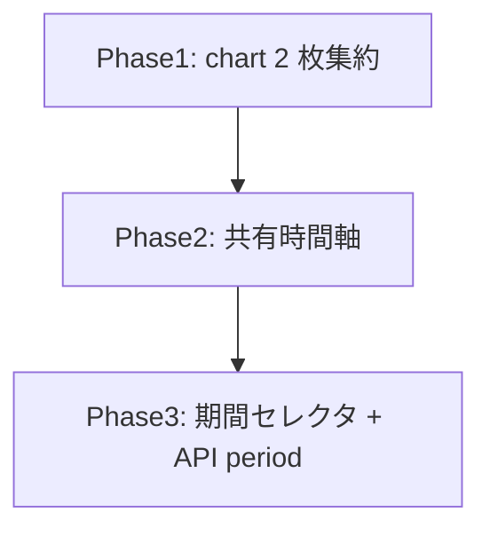

# dashboard 変更計画書（上部 chart 時間軸統一 + 期間選択 + usd 系 chart 削除）

> **入力**: `./001_REVISE_SPEC.md`, `../../concept.md`, Step 2 で読んだ既存実装
> **最終更新**: 2026-06-08

---

## 1. 既存ファイル変更一覧

| ファイル | 変更内容（概要） | リスク | 関連 SPEC § |
|---|---|---|---|
| `src/features/dashboard/summary.ts` | `DASHBOARD_CHARTS` を 2 件（mau/revenue_total_yen）に削減。`DASHBOARD_CHART_SOURCE_METRICS` を `[mau, revenue_total_yen]` に。`buildCharts` の profit 派生分岐（derived branch）を削除（`profitAt` import はテーブル側 computeProfitability が使うため profitability.ts 内では残置、summary.ts の buildCharts からの参照のみ除去）。VM コメント（常に 4/5 件 → 2 件）更新 | 中: profit 分岐削除で buildCharts 簡素化、テーブル採算列は別経路（computeProfitability）で無影響を確認 | §2.2, §7.1 |
| `src/components/MetricChart.tsx` | `MetricChartProps` に `domain?: [number, number]` 追加。XAxis の `domain={["dataMin","dataMax"]}` を `domain={domain ?? ["dataMin","dataMax"]}` に | 低: optional、未指定で従来動作 | §2.2, §7.2 |
| `src/features/dashboard/DashboardCharts.tsx` | (a) 全 chart series points から共有 `[minMs,maxMs]` を算出し各 MetricChart に `domain` を渡す（点ゼロなら undefined）。(b) ヘッダ固定文言「直近 30 日の推移」を「収益・利用の推移」＋**期間セレクタ**（全期間/30日/7日）に変更。period と onPeriodChange を props で受ける | 中: UI 追加。bucketEpoch 同等の正規化で domain を算出（MetricChart 内 mergeSeries と整合） | §2.2, §7.1, §7.2 |
| `src/features/dashboard/DashboardView.tsx` | `DashboardCharts` に period/onPeriodChange を中継。Props に period/onPeriodChange 追加 | 低 | §7.1 |
| `src/features/dashboard/DashboardPage.tsx` | `period` state（既定 `"30d"`）追加。`useFetch<DashboardVM>(\`/api/dashboard/summary?period=${period}\`)` に変更（url 変化で自動 refetch）。setPeriod を View へ渡す | 低: useFetch は url 依存で再取得（既存挙動） | §7.2 |
| `api/dashboard/summary.ts` | `req.query.period` を読み allowlist (`all`/`30d`/`7d`、既定 `30d`) で sinceIso を算出（`all` = `new Date(0).toISOString()`、`7d` = now−7日、`30d` = now−30日）。`recentSnapshots(db, sinceIso, [...DASHBOARD_CHART_SOURCE_METRICS])` はそのまま（SOURCE_METRICS が 2 件に減る） | 低: additive query、未指定は従来 30 日 | §2.2, §7.2, §7.4 |

## 2. 新規ファイル一覧

| ファイル | 責務 | 依存 | LOC 見積 |
|---|---|---|---|
| （任意）`src/features/dashboard/chartPeriod.ts` | period 型 `ChartPeriod = "all"\|"30d"\|"7d"`、`periodToSinceIso(period, nowMs)` 純関数、`parsePeriod(raw): ChartPeriod`（allowlist 正規化）。client/server/test で共有し DRY 化 | types | ~30 |

> 補足: period ロジックは小さいので summary.ts / api に直書きでも可。ただし `parsePeriod` と `periodToSinceIso` を純関数に切り出すと unit test が容易（§003 参照）。**推奨 = 切り出す**。

## 3. 削除ファイル一覧

| ファイル | 削除理由 | 代替 |
|---|---|---|
| （なし） | ファイル単位の削除は無し。削除は `DASHBOARD_CHARTS` の usd 系 3 エントリと `buildCharts` の profit 派生分岐（コード内削除） | — |

> `profitability.ts` は**削除しない**: `profitAt` / `computeProfitability` は一覧テーブル「採算」列が引き続き使用（§001 [論点-001]）。

## 4. マイグレーション要否

- DB スキーマ変更: ❌
- 既存データ変換: ❌（usage_snapshots はそのまま、収集も継続）
- 設定ファイル変更: ❌
- ストレージパス変更: ❌

→ **マイグレーション計画（005）は不要**。

## 5. 実装 Phase 分割（`/flow:tdd-phase` 連携）

### Phase 1: chart 集約（usd 系削除）— RED→GREEN→IMPROVE
- 対象: `summary.ts`（DASHBOARD_CHARTS 2 件 / SOURCE_METRICS 2 件 / buildCharts profit 分岐削除）
- ゴール: charts が常に 2 件（mau, revenue_total_yen）。profit/課金額/コスト chart が VM に出ない。テーブル採算列は無影響。

### Phase 2: 共有時間軸 — RED→GREEN→IMPROVE
- 対象: `MetricChart.tsx`（domain prop）, `DashboardCharts.tsx`（共有 domain 算出 + 配布）
- ゴール: 複数 chart に同一 `[minMs,maxMs]` が渡り XAxis domain が一致。点ゼロ時は未指定で従来 fallback。service-detail（単体 series, domain 未指定）はリグレッション無し。

### Phase 3: 期間セレクタ + API period — RED→GREEN→IMPROVE
- 対象: `chartPeriod.ts`（新規, parsePeriod/periodToSinceIso）, `api/dashboard/summary.ts`, `DashboardPage.tsx`, `DashboardView.tsx`, `DashboardCharts.tsx`（セレクタ UI）
- ゴール: `?period=7d/30d/all` で since 切替（未指定/不正=30d）。UI セレクタ変更で url 変化→refetch→範囲同期。default 30日で現行挙動維持。

## 6. 依存関係順序

> Phase1（chart 削減）→ Phase2（残 2 枚で軸統一）→ Phase3（期間で軸範囲を動かす）の順で、後段が前段の前提に積み上がる。

## 7. ロールアウト計画

| ステップ | 内容 | 期日 | 検証方法 |
|---|---|---|---|
| 1 | 実装 + unit green | 2026-06-08 | `npm test`（or vitest）全 green |
| 2 | E2E（dashboard）green | 2026-06-08 | Playwright: chart 2 枚 / 期間切替 / 軸統一 |
| 3 | ローカル動作確認 | 2026-06-08 | 期間セレクタで x 軸・件数が変わる、2 chart のみ |
| 4 | デプロイ（一括） | — | post-deploy smoke（/ で chart 2 枚 + セレクタ表示） |

## 8. リスク・注意点

- `buildCharts` の profit 分岐削除時、テーブル「採算」列（computeProfitability 経由）に波及しないことをテストで固定（別経路なので無影響だが回帰防止）。
- 共有 domain は `bucketEpoch` 相当（分バケット）で min/max を算出し、MetricChart 内の x 正規化と整合させる（ズレると軸端で点が見切れる）。
- `all` 期間は件数が増えうる。recentSnapshots は capturedAt index 前提で許容。極端な肥大は将来のページング/間引きで対応（今回は対象外）。
- service-detail の MetricChart 利用が domain 未指定で従来描画されることをリグレッションで担保。

## 9. 完了の定義 (DoD)

- [ ] 全 Phase 完了
- [ ] charts VM が 2 件（mau/revenue_total_yen）、usd 系 3 chart 不在
- [ ] 複数 chart の XAxis domain が一致（共有 domain）
- [ ] `?period=all|30d|7d` で since 切替・未指定=30d
- [ ] UI 期間セレクタ → refetch → 軸同期
- [ ] service-detail MetricChart リグレッション無し
- [ ] 単体テストカバレッジ目標達成
- [ ] E2E シナリオ全成功（含むリグレッション）
- [ ] `/flow:feedback` 通過（任意）

## 10. 更新履歴
| 日付 | 変更概要 | 実行者 |
|---|---|---|
| 2026-06-08 | 初版作成 | /flow:revise |
