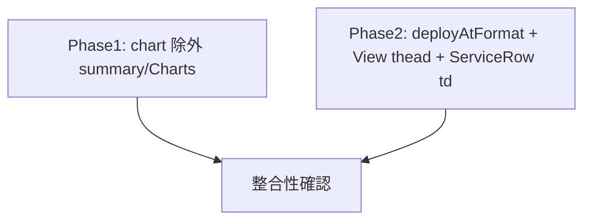

# dashboard 変更計画書（last_deploy_at をチャートから外し一覧に日時カラム追加）

> **入力**: `./001_REVISE_SPEC.md`, `../../concept.md`, Step 2 で読んだ既存実装
> **最終更新**: 2026-05-30

---

## 1. 既存ファイル変更一覧

| ファイル | 変更内容（概要） | リスク | 関連 SPEC § |
|---|---|---|---|
| `src/features/dashboard/summary.ts` | `DASHBOARD_CHART_METRICS` から `"last_deploy_at"` を除外（4→3）。JSDoc「主要 4 metric」→「主要 3 metric」更新。`METRIC_UNIT_FALLBACK.last_deploy_at` は残置可（buildCharts は対象外 metric を無視するため無害、削除しても可） | 低 | §2.1, §2.3 |
| `src/features/dashboard/DashboardView.tsx` | `<thead>` に `<th>最終デプロイ</th>` を追加（service 列の後、MAU 系の前 or alerts の後ろ — 配置は §下記）。 | 低 | §2.2, §7.1 |
| `src/features/dashboard/ServiceRow.tsx` | 対応する `<td>` を追加。`row.metrics.last_deploy_at?.value` を `formatDeployAt` で整形。未収集は `—`。 | 低 | §7.1, §7.2 |
| `src/features/dashboard/DashboardCharts.tsx` | JSDoc「主要 4 metric (... last_deploy_at)」→「主要 3 metric」に文言修正（描画ロジックは `charts` を map するだけなので機能変更なし、コメント整合のみ） | なし | §2.1 |

### カラム配置方針
既存列順: status / service / MAU / 採算 / 離脱率 / errors / alerts。
「最終デプロイ」は運用情報のため **末尾（alerts の後ろ）に追加**。既存列の順序・意味を一切変えず additive を担保する。

## 2. 新規ファイル一覧

| ファイル | 責務 | 依存 | LOC 見積 |
|---|---|---|---|
| `src/features/dashboard/deployAtFormat.ts` | epoch_ms → `YYYY-MM-DD HH:MM`（JST）整形。不正値/未収集は `—`。決定的（now 非依存）。 | なし（`lastUpdatedFormat.ts` の `formatJst` 方式を踏襲、共通化は任意） | ~20 |

> 補足: `lastUpdatedFormat.ts` 内 `formatJst` は非 export。重複を避けるなら `formatJst` を export して再利用も可。本計画では責務分離のため `deployAtFormat.ts` に独立実装（epoch_ms 入力 + `—` fallback という入力契約が異なるため）。実装時 `/flow:tdd` で重複度を見て判断。

## 3. 削除ファイル一覧

| ファイル | 削除理由 | 代替 |
|---|---|---|
| （なし） | — | — |

> `MetricChart.tsx` の `last_deploy_at` tickFormatter 分岐は service-detail 用に残置（§3 影響範囲注記）。

## 4. マイグレーション要否

- DB スキーマ変更: ❌
- 既存データ変換: ❌
- 設定ファイル変更: ❌
- ストレージパス変更: ❌

→ **MIGRATION ドキュメント不要**（005 は生成しない）。

## 5. 実装 Phase 分割（`/flow:tdd-phase` 連携）

### Phase 1: chart から last_deploy_at 除外（RED→GREEN→IMPROVE）
- 対象: `summary.ts`（`DASHBOARD_CHART_METRICS`）, `DashboardCharts.tsx`（コメント）
- ゴール: `buildDashboard().charts` が 3 件になる。`DashboardCharts` が last_deploy_at chart を描画しない。既存 chart test を 3 件化。

### Phase 2: 一覧に最終デプロイ日時カラム追加（RED→GREEN→IMPROVE）
- 対象: `deployAtFormat.ts`（新規）, `DashboardView.tsx`（thead）, `ServiceRow.tsx`（td）
- ゴール: フォーマッタ単体テスト green。テーブルに「最終デプロイ」列が出て、値あり=JST 日時 / 未収集=`—`。

## 6. 依存関係順序

Phase 1 と Phase 2 は独立（依存なし）。順不同で実装可だが、テスト分割の明瞭さから Phase 1 → Phase 2 の順を推奨。

## 7. ロールアウト計画

| ステップ | 内容 | 期日 | 検証方法 |
|---|---|---|---|
| 1 | 実装 + unit green | 2026-05-30 | `npm test` |
| 2 | E2E + 視覚確認 | 実装後 | `/flow:e2e` + headless スクショ |
| 3 | デプロイ（次回 dashboard デプロイに同梱） | 次回リリース | post-deploy smoke |

## 8. リスク・注意点

- ServiceRow のテストが列インデックス/列数に依存している場合、列追加で既存アサーションが破綻し得る → 003 で確認・修正。
- `metrics.last_deploy_at.value` の単位は epoch_ms 前提。providers/adapters の last_deploy_at 出力単位を再確認（既存 chart も epoch_ms 前提のため整合済みのはず）。
- `formatJst` 重複: DRY か責務分離かは tdd 時に判断（§2 補足）。

## 9. 完了の定義 (DoD)

- [ ] Phase 1-2 完了
- [ ] `buildDashboard().charts` が 3 件（last_deploy_at 不在）
- [ ] テーブルに「最終デプロイ」列、値あり=JST 日時 / 未収集=`—`
- [ ] 単体テスト green（既存修正 + 新規追加）
- [ ] E2E + 視覚確認 green（含むリグレッション）
- [ ] `/flow:spec-review` または `/flow:feedback` 通過

## 10. 更新履歴
| 日付 | 変更概要 | 実行者 |
|---|---|---|
| 2026-05-30 | 初版作成 | /flow:revise |
