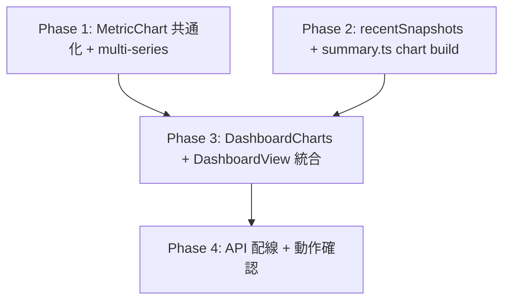

# dashboard 変更計画書 (timeseries-topchart)

> **入力**: `./001_REVISE_SPEC.md`, `../../concept.md` §1.4, Step 2 で読んだ実装 (DashboardView/ServiceRow/summary.ts + MetricChart.tsx + api/dashboard/summary + queries.ts)
> **最終更新**: 2026-05-28

---

## 1. 既存ファイル変更一覧

| ファイル | 変更内容 (概要) | リスク | 関連 SPEC § |
|---|---|---|---|
| `src/features/dashboard/summary.ts` | (1) `DashboardChart` / `DashboardChartSeries` 型新規追加 (2) `DashboardVM.charts: DashboardChart[]` 追加 (3) `buildDashboard(services, snapshots, openAlerts, lastRun, chartSnapshots?)` シグネチャに第 5 引数 `chartSnapshots: SnapshotRow[]` 追加 (optional、未渡しは空 chart 配列) (4) 4 主要 metric (`up` / `mau` / `db_storage_bytes` / `last_deploy_at`) で chart 集約 | 中 (型シグネチャ拡張 + buildDashboard 引数追加) | §7.3 |
| `src/db/queries.ts` | 新関数 `recentSnapshots(db, sinceIso, metricKeys?)` 追加: 全 service 横断 + optional metric filter で `usage_snapshots` を 1 query で取得 | 低 (新規関数のみ、既存 query 影響なし) | §7.3 |
| `api/dashboard/summary.ts` | 既存 `Promise.all([latest, alerts, runs])` に **`recentSnapshots(db, sinceIso30d, [up,mau,db_storage_bytes,last_deploy_at])` を 4 件目として並列追加** + `buildDashboard(..., chartSnapshots)` に渡す | 低 (1 query 並列追加、cold start で追加 RTT 0) | §2.2 <!-- spec-review R1: 並列実行で既存パターン継承 --> |
| `src/features/dashboard/DashboardView.tsx` | テーブル `<table>` の直前に `<DashboardCharts charts={vm.charts} />` 挿入。**section header = `<h2>直近 30 日の推移</h2>` + border-bottom = `1px solid var(--border, #2a2f3a)`** (既存 force-pull section DashboardView.tsx:74-80 と同パターン継承) | 低 (新 section 挿入のみ、既存テーブル不変) | §7.1 <!-- spec-review R4: section header 文言 + border 既存パターン整合 --> |
| `src/features/dashboard/DashboardView.test.tsx` | テスト追加: 上部 chart section が render される / 空 chart で「データなし」表示 / table が依然 render される (リグレッション) | 低 | 003 |
| `src/features/dashboard/summary.test.ts` | テスト追加: FP-TS-01〜04 (chart 集約ロジック、4 metric、空 snapshots) | 低 | 003 |
| `src/features/service-detail/MetricChart.tsx` | **移動 + signature 統一**: `src/components/MetricChart.tsx` へ move、`series: MetricSeries` (single) → `series: MetricSeriesMulti[]` (multi、{slug,name,metricKey,unit,points}[]) に signature 変更。`last_deploy_at` chart の Y 軸は **`tickFormatter={(v) => new Intl.DateTimeFormat('ja-JP',{month:'numeric',day:'numeric'}).format(new Date(v))}`** で `M/D` 表示 (生 epoch_ms 値表示禁止) | 低 (import path 変更 + ServiceDetailView 側で 1 series wrap) | §7.2 [論点-TS3] <!-- spec-review R5: signature 統一、R3: tickFormatter 具体化 --> |
| `src/features/service-detail/ServiceDetailView.tsx` + 同 test | import path 修正 + **MetricChart 呼び出しを 1 series wrap に変更**: `<MetricChart series={[{slug: vm.slug, name: vm.name, metricKey: s.metricKey, unit: s.unit, points: s.points}]} />` | 低 (2 行 + caller wrap) | §7.2 <!-- spec-review R5: caller 側 wrap --> |
| `src/components/tokens.ts` (or tokens.css) | CSS var `--chart-series-0` 〜 `--chart-series-7` (8 色 palette) 追加。色相環で均等配分、light/dark 両対応 | 低 (CSS var 追加のみ、既存 token 影響なし) | §8 [論点-TS4] |

## 2. 新規ファイル一覧

| ファイル | 責務 | 依存 | LOC 見積 |
|---|---|---|---|
| `src/components/MetricChart.tsx` | 単一 metric 時系列 chart (recharts LineChart)、複数 series 対応に拡張: `MetricSeriesMulti = {slug, name, points}[]` を受け取り line 多重描画 + Legend | recharts, types/index.js | ~50 (既存 25 + 多重 series 対応 25) |
| `src/components/MetricChart.test.tsx` | service-detail からの移動 + dashboard 用拡張テスト (multi-series 重ね描き、Legend、色 palette) | vitest + react-testing-library | ~80 |
| **`src/features/dashboard/DashboardCharts.tsx`** | dashboard 上部 chart section、`charts: DashboardChart[]` を受け取り `MetricChart` を 4 件縦並び + 各 chart に全 service 重ね描き + section header「直近 30 日」 | MetricChart, types | ~60 |
| `src/features/dashboard/DashboardCharts.test.tsx` | 4 chart render / 空 chart で「データなし」 / service 別色 / section header | vitest + RTL | ~80 |

## 3. 削除ファイル一覧

| ファイル | 削除理由 | 代替 |
|---|---|---|
| `src/features/service-detail/MetricChart.tsx` | `src/components/MetricChart.tsx` に共通化 move (P19/P3 重複回避) | 共通化後 import path 変更 |
| `src/features/service-detail/MetricChart.test.tsx` | 同上、テストも `src/components/` に移動 | 同上 |

## 4. マイグレーション要否

- DB スキーマ変更: ❌ 不要 (既存 `usage_snapshots` 流用)
- 既存データ変換: ❌ 不要
- 設定ファイル変更: ❌ 不要
- ストレージパス変更: ❌ 不要

→ **Phase 5 REVISE_MIGRATION は生成しない** (本 revise は DB schema 不変、純 UI/VM/API 拡張)

## 5. 実装 Phase 分割 (`/flow:tdd-phase` 連携)

### Phase 1: MetricChart 共通化 + multi-series 拡張 (RED→GREEN→IMPROVE)
- **対象**: `src/features/service-detail/MetricChart.tsx` → `src/components/MetricChart.tsx` 移動 + props 拡張 (multi-series 対応) + tokens.ts に色 palette 追加 + service-detail から import path 修正
- **ゴール**: MetricChart 既存テスト green 維持 (single series) + multi-series 新規テスト green + service-detail も新 import path で green

### Phase 2: DB クエリ + summary.ts chart build (RED→GREEN→IMPROVE)
- **対象**: `src/db/queries.ts` に `recentSnapshots` 追加 + queries テスト + `summary.ts` に DashboardChart 型 / buildDashboard chartSnapshots 引数追加 + summary テスト
- **ゴール**: recentSnapshots テスト green (全 service × metric filter)、buildDashboard が chartSnapshots から DashboardChart[] を生成、charts.series で全 service 重ね描き準備

### Phase 3: DashboardCharts component + DashboardView 統合 (RED→GREEN→IMPROVE)
- **対象**: `src/features/dashboard/DashboardCharts.tsx` 新規 + 同テスト + `DashboardView.tsx` に section 挿入 + DashboardView テスト
- **ゴール**: dashboard render で上部 4 chart + 下部テーブル両方表示、空 chart で「データなし」表示

### Phase 4: API endpoint 配線 + post-deploy 検証 (RED→GREEN→IMPROVE)
- **対象**: `api/dashboard/summary.ts` で recentSnapshots 呼び出し追加 + 既存 dashboard API test 緑維持確認
- **ゴール**: `/api/dashboard/summary` レスポンスに charts: DashboardChart[] が含まれる、ローカルで dashboard 表示確認

## 6. 依存関係順序

Phase 1 と Phase 2 は並行可能 (型/関数追加のみ、依存なし)。Phase 3 が両方を統合、Phase 4 で API 経由全体動作確認。

`/flow:tdd` シングルスレッド実行では順次 1→2→3→4。

## 7. ロールアウト計画

| ステップ | 内容 | 期日 | 検証方法 |
|---|---|---|---|
| RO-1 | Phase 1-4 実装 + tdd green | 本 revise 後の `/flow:tdd` セッション | unit test green + 既存 e2e green |
| RO-2 | 次回 deploy (8th deploy 予定) で本番反映 | tdd 完了直後の release | post-deploy smoke で `/api/dashboard/summary` レスポンスに charts 含む確認 |
| RO-3 | 本番 dashboard で上部 chart 表示確認 | RO-2 後 | admin ログイン → / で上部 4 chart + 下部テーブル両方表示、データは現状 30 日 cron 蓄積分 |
| RO-4 | service 数増加時の見栄え確認 (将来) | bousai-bag-checker 連動 producer 完了後 (CF-016) or 新 service 追加時 | 複数 service 重ね描き UX 検証、見にくくなれば次 revise (フィルタ UI / per-service mini-chart 等) |

**フィーチャーフラグ**: 不要 (additive 後方互換、admin UI のみ、public 影響なし)

## 8. リスク・注意点

- **API response サイズ増**: 現状 service 1 件 × 4 metric × 30 日 = 120 points = 軽量 (< 5KB)。将来 service 10 件で 1200 points = ~50KB、network 問題なし。100+ service なら paging or レンジ縮小検討
- **chart 描画 perf**: recharts は SVG ベース、4 chart × 多重 line でも問題なし (既存 service-detail で実証)
- **MetricChart 共通化の波及**: service-detail からの import path 1 行変更のみ、test も同所 move、Phase 1 で完結
- **service 別色 palette の不足**: 8 色 palette で 8+ service 数になると色が枯れる → 次 revise で対応 (色相環で均等生成 or 同色 + dash 線スタイル)
- **`last_deploy_at` の表示**: epoch_ms 値そのままだと巨大数値、Y 軸表示で読みにくい可能性 → recharts `tickFormatter` で「Mon DD」表示推奨 (Phase 1 で対応)
- **空データ時の UI**: cron 未実行 / 新規 service は 0 points、各 chart に「データなし」placeholder で fallback (既存 MetricChart の挙動継承)
- **shipyard public API への影響**: なし (本改修は内部 dashboard のみ、`/api/public/status` は最新値のまま不変、CF-020「新フィールド追加時の表示先逆引き」観点でも shipyard は scope 外と明示)

## 9. 完了の定義 (DoD)

- [ ] Phase 1-4 完了
- [ ] 単体テストカバレッジ目標達成 (行 80% / 分岐 70% 継承)
- [ ] 既存テスト全 green (リグレッション 0)
- [ ] dashboard /api/dashboard/summary レスポンスに `charts: DashboardChart[]` 含む
- [ ] dashboard 画面で上部 4 chart + 下部テーブル両方表示
- [ ] 各 chart 空データ時の「データなし」表示
- [ ] `/flow:spec-review` 通過推奨 (UI レイアウト + データパイプライン拡張)
- [ ] X-th deploy 後の本番動作確認

## 10. 更新履歴

| 日付 | 変更概要 | 実行者 |
|---|---|---|
| 2026-05-28 | 初版作成 (Phase 1-4 + MetricChart 共通化 + recentSnapshots クエリ + DashboardCharts 新 component + 8 色 palette) | /flow:revise |
