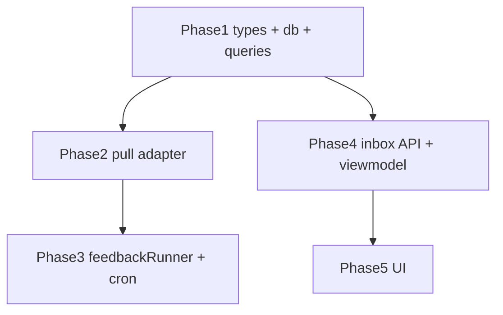

# feedback-inbox 実装計画書

> **入力**: `./001_feedback-inbox_SPEC.md`, `../concept.md` §1.4 / §4.3
> **最終更新**: 2026-06-18

---

## 1. 実装対象ファイル一覧

| ファイル | 責務 | 依存 | LOC 見積 |
|---|---|---|---|
| `src/types/feedback.ts` | `FeedbackKind` / `FeedbackItem` / `FeedbackResponse` 契約型 | (なし) | ~30 |
| `src/types/index.ts` | feedback 型を re-export (既存に追記) | feedback.ts | ~2 |
| `src/db/schema.ts` | `feedbackItems` pgTable + index 追加 (既存に追記) | drizzle | ~25 |
| `src/db/queries.ts` | `upsertFeedbackItems(db, rows)` / `listFeedback(db, filter)` (既存に追記) | schema | ~50 |
| `src/db/index.ts` | 新 query を re-export (既存に追記) | queries | ~2 |
| `src/providers/feedback.ts` | feedback pull adapter (`fetchFeedback(service, deps)` → endpoint origin 派生 → 検証 → FeedbackItem[])。`safeFetch` を**直接利用** (adapters.ts の `getJson` は private、複製しない、R4) | fetch (safeFetch), types | ~90 |
| `src/features/collection/feedbackRunner.ts` | **新規** feedback orchestration `runFeedbackCollection(deps)` (per-service pull → upsert、runner.ts とは別関数、R1)。エラーは独自記録 (R3) | providers/feedback, db | ~60 |
| `api/feedback/inbox.ts` | `GET /api/feedback/inbox` ハンドラ (requireSeiji + フィルタ + listFeedback) | db, auth, registry | ~50 |
| `api/cron/collect.ts` | 既存 cron で `runFeedbackCollection` を `runCollection` と並行 invoke (既存に追記、R1) | feedbackRunner | ~8 |
| `src/features/feedback-inbox/inbox.ts` | inbox ビューモデル整形 (フィルタ正規化 / slug→name 解決 / claim テンプレ生成) | types, registry | ~60 |
| `src/features/feedback-inbox/FeedbackInboxView.tsx` | 一覧 + フィルタ UI (presentational)。行のサービス識別は既存 `components/ServiceIcon`、状態は `StatusDot` を再利用 (R5) | react, ServiceIcon, StatusDot | ~120 |
| `src/features/feedback-inbox/FeedbackInboxPage.tsx` | データ取得 + ルート (Clerk ゲート、`/feedback`) | clerk-react, View | ~50 |
| `src/main.tsx` | `/feedback` ルート追加 (既存に追記) | react-router, Page | ~3 |

<!-- spec-review R1: runner.ts は変更せず別 orchestration 関数 feedbackRunner.ts に分離 (metrics batch invariant 保護) -->
> **R1 (責務分離)**: `runCollection` (runner.ts) は ProviderAdapter/UsageMetric の metrics batch (単一 capturedAt / 非有限 skip / batch insert) を扱う fragile かつ重要なコード。feedback は item list で粒度が違うため **runner.ts を変更せず** 別関数 `runFeedbackCollection` を新設し、`api/cron/collect.ts` で両者を invoke する。

> ※ スタック = concept §4.3 確定: TypeScript / React 19 + Vite + react-router-dom / Vercel serverless (`api/`) / drizzle-orm + Neon / Clerk / zod / vitest。

## 2. 実装 Phase 分割（`/flow:tdd` / `/flow:tdd-phase` 連携）

### Phase 1 (RED→GREEN→IMPROVE): 契約型 + DB スキーマ + queries
- 対象: `src/types/feedback.ts`, `src/db/schema.ts` (`feedbackItems`), `src/db/queries.ts` (`upsertFeedbackItems` / `listFeedback`)
- テスト対象: 型コンパイル、idempotent upsert (同 (slug, externalId) 重複で 1 行)、listFeedback フィルタ (service/kind/since/limit)
- ゴール: feedback の保存・取得の核が green (pglite test DB)

### Phase 2 (RED→GREEN→IMPROVE): pull adapter
- 対象: `src/providers/feedback.ts` (`fetchFeedback`)
- テスト対象: 正常パース、404/timeout/401 で空配列 + エラー記録、不正スキーマ reject、body length cap、未知 kind skip、無効 createdAt skip。`safeFetch` は mock 注入
- ゴール: pull の検証ロジックが green (実 HTTP なし、mock)

### Phase 3: feedback orchestration (runner と分離) + cron 配線
- 対象: `src/features/collection/feedbackRunner.ts` (新規 `runFeedbackCollection`) + `api/cron/collect.ts` 配線。**runner.ts は変更しない** (R1)
- テスト対象: per-service で feedback pull → upsert、1 サービスの feedback 失敗が他サービスをブロックしない (per-service try/catch)、エラーが戻り値サマリに記録 (R3)、既存 `runner.test.ts` は無改変で green 維持
- ゴール: feedbackRunner テスト green + 既存 collection テスト回帰なし

### Phase 4: inbox API + ビューモデル
- 対象: `api/feedback/inbox.ts`, `src/features/feedback-inbox/inbox.ts`
- テスト対象: requireSeiji 認証 (401 path)、フィルタ適用、slug→name 解決、claim テンプレ生成文字列
- ゴール: API + ビューモデルが green

### Phase 5: UI (React)
- 対象: `FeedbackInboxView.tsx` / `FeedbackInboxPage.tsx` / `main.tsx` ルート
- テスト対象 (testing-library): 一覧描画、kind バッジ、フィルタ操作、空状態、トリアージ (claim テンプレ表示/コピー)
- ゴール: UI コンポーネントテスト green。視覚レビューは `/flow:design --review-only` (P4.4 gate)

## 3. 依存関係順序

## 4. 既存ファイルへの影響

| ファイル | 変更内容 | リスク |
|---|---|---|
| `src/db/schema.ts` | `feedbackItems` table + `schema` export に追加 | 低 (新規テーブル、既存に非破壊)。prod 反映は `db:push` = Class B |
| `src/db/queries.ts` / `index.ts` | feedback query 追加 + re-export | 低 |
| `src/types/index.ts` | feedback 型 re-export | 低 |
| `src/features/collection/runner.ts` | **変更しない** (R1: feedback は別関数 feedbackRunner に分離) | なし |
| `api/cron/collect.ts` | `runFeedbackCollection` を追加 invoke (既存 `runCollection` 呼び出しに併設) | 低 (追記のみ) |
| `src/main.tsx` | `/feedback` ルート + ナビ追加 | 低 |

## 5. 横断フォルダへの追加・変更

| 横断フォルダ | 追加・変更内容 |
|---|---|
| `_shared/types` | `FeedbackKind` / `FeedbackItem` / `FeedbackResponse` 型を追加 (後方互換、新規) |
| `_shared/db` | `feedback_items` テーブル + queries |
| `_shared/providers` | feedback pull adapter (`safeFetch` 再利用) |
| `_shared/auth` | 変更なし (`requireSeiji` を利用するのみ) |

## 6. リスク・注意点

- **責務分離 (R1)**: feedback は metrics ではないため `runCollection`/`ProviderAdapter` に混ぜない。`runFeedbackCollection` 別関数で。
- **fetch 再利用 (R4)**: feedback adapter は `safeFetch` を直接使う (adapters.ts の private `getJson` を複製・export しない)。SSRF/timeout/redirect 抑止は safeFetch が担保。
- **DB マイグレーション (Class B)**: `feedback_items` テーブル追加は `db:push` で prod 反映が必要 = `/flow:release` の Class B 工程。コード実装 (Class A) と prod 反映は分離。
- **producer 未実装期間**: 当面どのサービスも `/api/hub/feedback` 未実装 → 全サービス空 items/404。これは設計通り (graceful degradation)。inbox は空状態を正しく表示すること。
- **PII**: producer 側 scrub 前提だが、HUB 側でも body length cap + rawJson 非保存で露出面を最小化。
- **共通シークレット**: `HUB_SERVICE_INFO_SECRET` は service-info と共用 (新規 env 追加なし)。`.env.example` 変更不要。
- **既存 collection runner の回帰**: feedback 統合で既存 metrics pull テストを壊さないこと。

## 7. 完了の定義（Definition of Done）

- [ ] Phase 1-5 完了
- [ ] 単体テストカバレッジ目標達成 (行 80% / 分岐 70%)
- [ ] E2E シナリオ (運営者インボックス閲覧 + フィルタ) green
- [ ] 視覚デザインレビュー green (`/flow:design`、P4.4 gate)
- [ ] レビュー (`/flow:spec-review`) 通過
- [ ] audit #4 で O67 `required_signals` (`/api/hub/feedback` + `FeedbackItem`) が PASS

## 8. 更新履歴
| 日付 | 変更概要 | 実行者 |
|---|---|---|
| 2026-06-18 | 初版作成 | /flow:feature |
