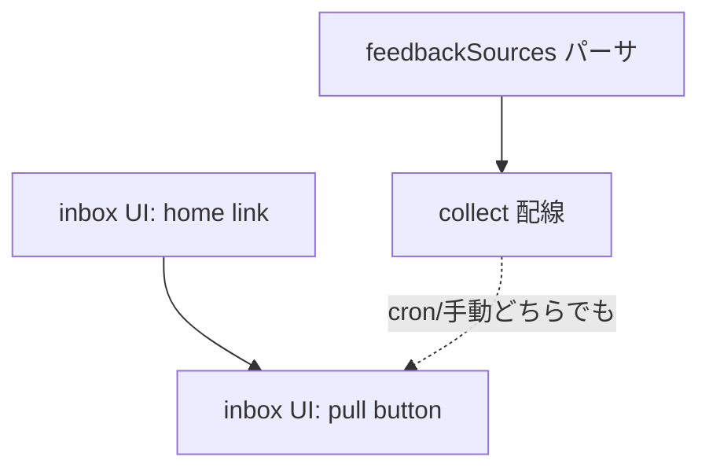

# feedback-inbox 変更計画書（無登録 shipyard pull + インボックス操作導線）

> **入力**: `./001_REVISE_SPEC.md`, `../../concept.md`, Step 2 で読んだ既存実装
> **最終更新**: 2026-06-19

---

## 1. 既存ファイル変更一覧

| ファイル | 変更内容（概要） | リスク | 関連 SPEC § |
|---|---|---|---|
| `api/admin/collect.ts` | `runFeedbackCollection` の `loadServices` を `mergeFeedbackSources(registered, env)` に差し替え (env 由来ソースを合流) | 低 (additive・dedup) | §7.1 |
| `api/cron/collect.ts` | 同上 (cron 版も同対象に。手動と cron で挙動を一致させる) | 低 | §7.1 |
| `src/features/feedback-inbox/FeedbackInboxView.tsx` | ヘッダに `<a href="/">ホーム</a>` + 「今すぐ pull」ボタン section を追加 (dashboard idiom 移植)。`onForcePull?` / `forcePullState?` props 追加 | 低 (additive) | §7.1 UC-nav/pull |
| `src/features/feedback-inbox/FeedbackInboxPage.tsx` | `useFetch` の `refetch` 取得、`onForcePull` (POST /api/admin/collect → refetch) を実装し View に配線 | 低 | §7.1 UC-pull |

## 2. 新規ファイル一覧

| ファイル | 責務 | 依存 | LOC 見積 |
|---|---|---|---|
| `src/features/collection/feedbackSources.ts` | `HUB_FEEDBACK_SOURCES` env を parse → 合成 `ServiceDescriptor[]`。`mergeFeedbackSources(registered, env)` で registered 優先 dedup マージ。slug 正規表現 + `isSafePublicUrl` 検証、不正 skip + warn | `registry/schema` の安全 URL 判定 (`src/lib/safeUrl`), `types` | ~60 |
| `src/features/collection/feedbackSources.test.ts` | 上記の単体テスト | vitest | ~80 |

## 3. 削除ファイル一覧

| ファイル | 削除理由 | 代替 |
|---|---|---|
| (なし) | additive 改修 | — |

## 4. マイグレーション要否

- DB スキーマ変更: ❌
- 既存データ変換: ❌
- 設定ファイル変更: ✅ (env `HUB_FEEDBACK_SOURCES` 追加 — `.env.example` 系に記載)
- ストレージパス変更: ❌

→ **005_REVISE_MIGRATION は不要**。

## 5. 実装 Phase 分割（`/flow:tdd` 連携）

### Phase 1: feedbackSources パーサ (RED→GREEN→IMPROVE)
- 対象: `feedbackSources.ts` (parse / 検証 / merge dedup)
- ゴール: 正常 JSON→合成 descriptor、不正 JSON/エントリ skip、registered 優先 dedup を単体で担保

### Phase 2: 配線
- 対象: `api/admin/collect.ts` + `api/cron/collect.ts` の feedback pull に merge を配線
- ゴール: env 設定時に対象ソースが増える / 未設定で従来同一

### Phase 3: インボックス UI
- 対象: `FeedbackInboxView/Page` にホームリンク + 今すぐ pull
- ゴール: リンク遷移 / pull→refetch / 実行中 disabled

## 6. 依存関係順序

## 7. ロールアウト計画

| ステップ | 内容 | 期日 | 検証方法 |
|---|---|---|---|
| 1 | コード改修デプロイ | リリース時 | E2E + unit green |
| 2 | `HUB_FEEDBACK_SOURCES` を Vercel env に設定 (shipyard) | デプロイ後 | inbox「今すぐ pull」→ shipyard メッセージ表示 |

## 8. リスク・注意点

- env JSON の形式ミス → 全体 skip + warn で安全側に倒す (pull が registered のみに縮退、致命でない)。
- 無登録ソース slug が後日本登録された場合の二重 pull → merge dedup (registered 優先) で回避。
- pull ボタンは `requireSeiji` ゲート前提。未認証時は `http_401` を簡易表示 (dashboard と同挙動)。

## 9. 完了の定義 (DoD)

- [ ] 全 Phase 完了
- [ ] 単体テスト: feedbackSources (parse/検証/merge) green + 既存回帰なし
- [ ] E2E: inbox ホームリンク遷移 / 今すぐ pull→refetch / env ソース取り込み (mock) green
- [ ] マイグレーション: 該当なし
- [ ] `.env.example` 系に `HUB_FEEDBACK_SOURCES` 追記
- [ ] `/flow:design` 視覚レビュー (UI 追加分) 通過

## 10. 更新履歴
| 日付 | 変更概要 | 実行者 |
|---|---|---|
| 2026-06-19 | 初版作成 | /flow:revise |
