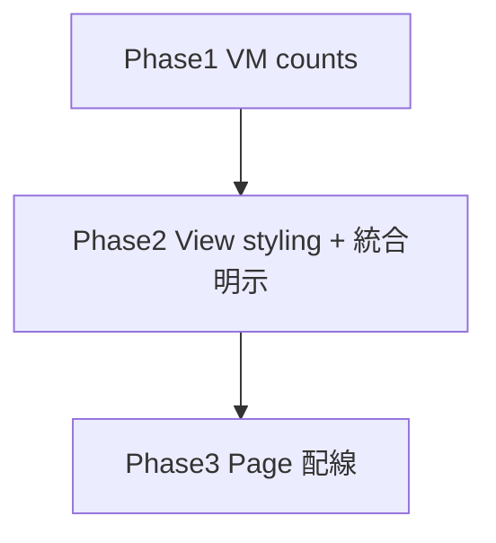

# feedback-inbox 変更計画書（インボックス UX — 統合一覧 + スタイル適用）

> **入力**: `./001_REVISE_SPEC.md`, `../../concept.md`, Step 2 で読んだ実装 (FeedbackInboxView/Page/inbox.ts) + design-system.md
> **最終更新**: 2026-06-18

---

## 1. 既存ファイル変更一覧

| ファイル | 変更内容（概要） | リスク | 関連 SPEC § |
|---|---|---|---|
| `src/features/feedback-inbox/inbox.ts` | `FeedbackInboxVM` に `counts: {total, byKind}` 追加。`buildInboxVM` で items から算出 (additive) | 低 | §2.2 |
| `src/features/feedback-inbox/FeedbackInboxView.tsx` | (a) 件数サマリ表示、(b) 絞り込みバーを token スタイル化 (service=styled select / kind=segmented chips / period=styled select)、(c) item 行のサービスアイコン+名を強調、(d) empty/button を token スタイル、(e) 共通スタイルを定数化 (raw 値直書きゼロ) | 中 (UI 全面、既存 testid 維持) | §2.1/§7.1/§7.5 |
| `src/features/feedback-inbox/FeedbackInboxPage.tsx` | VM 受け渡しのみ (counts は VM 内、props 変更最小) | 低 | §7.1 |

## 2. 新規ファイル一覧
| ファイル | 責務 | 依存 | LOC 見積 |
|---|---|---|---|
| (なし — 既存ファイル内で完結。スタイル定数は FeedbackInboxView 内 or 小さな styles オブジェクトに集約) | | | |

## 3. 削除ファイル一覧
| ファイル | 削除理由 | 代替 |
|---|---|---|
| (なし) | | |

## 4. マイグレーション要否
- DB スキーマ変更: ❌ / 既存データ変換: ❌ / 設定変更: ❌ / ストレージ変更: ❌ → **migration 不要** (presentation のみ)

## 5. 実装 Phase 分割（`/flow:tdd-phase` 連携）

### Phase 1 (RED→GREEN→IMPROVE): VM 件数算出
- 対象: `inbox.ts` `buildInboxVM` に `counts` (total + byKind) 算出を追加
- テスト: counts が表示 items から正しく集計される (全件 / 絞り込み後)
- ゴール: VM 拡張 green (既存 inbox.test 維持)

### Phase 2 (RED→GREEN→IMPROVE): View styling + 統合明示
- 対象: `FeedbackInboxView.tsx` — 件数サマリ + token スタイル絞り込みバー (kind=segmented chips) + item サービス強調 + empty/button スタイル。**スタイルは design-system トークンのみ (生値 hex 単独ゼロ、raw 未スタイル control ゼロ)**
- テスト (testing-library): 件数サマリ描画、kind chips でフィルタコールバック、サービス名/アイコン表示、空状態、既存 testid (`feedback-list`/`feedback-item`/`kind-badge`/`empty-state`/`filters`) 維持
- ゴール: View unit green

### Phase 3: Page 配線確認
- 対象: `FeedbackInboxPage.tsx` (VM 受け渡し、props 整合)
- テスト: 既存 Page 経路が green (loading/error/data)
- ゴール: 統合 green

## 6. 依存関係順序

## 7. ロールアウト計画
| ステップ | 内容 | 期日 | 検証方法 |
|---|---|---|---|
| 1 | unit + E2E green (視覚 baseline 更新) | 2026-06-18 | vitest + playwright |
| 2 | 視覚レビュー (P4.4、#2.6 token-conformance) | 2026-06-18 | /flow:design --review-only |
| 3 | 本番 deploy (20th 見込み、Class B) | 2026-06-18 | post-deploy smoke |

## 8. リスク・注意点
- 既存 `data-testid` を壊さない (E2E/unit が参照)。styling 変更で role/text を壊さない。
- 生値 hex 単独を入れない (CF-20260618-008 #2.6)。全て `var(--token, fallback)`。
- segmented chips の選択状態も token (選択 = `--accent` border/text、非選択 = `--text-muted`)。

## 9. 完了の定義 (DoD)
- [ ] Phase 1-3 完了
- [ ] unit カバレッジ目標達成 (既存 + 追加)
- [ ] E2E green (統合一覧 + 件数 + kind chips フィルタ + 空、視覚 baseline 更新)
- [ ] 視覚レビュー green (#2.6 token-conformance: 生値・raw control ゼロ、dashboard と整合)
- [ ] spec-review (905) 通過
- [ ] 本番 deploy + smoke green

## 10. 更新履歴
| 日付 | 変更概要 | 実行者 |
|---|---|---|
| 2026-06-18 | 初版作成 | /flow:revise |
