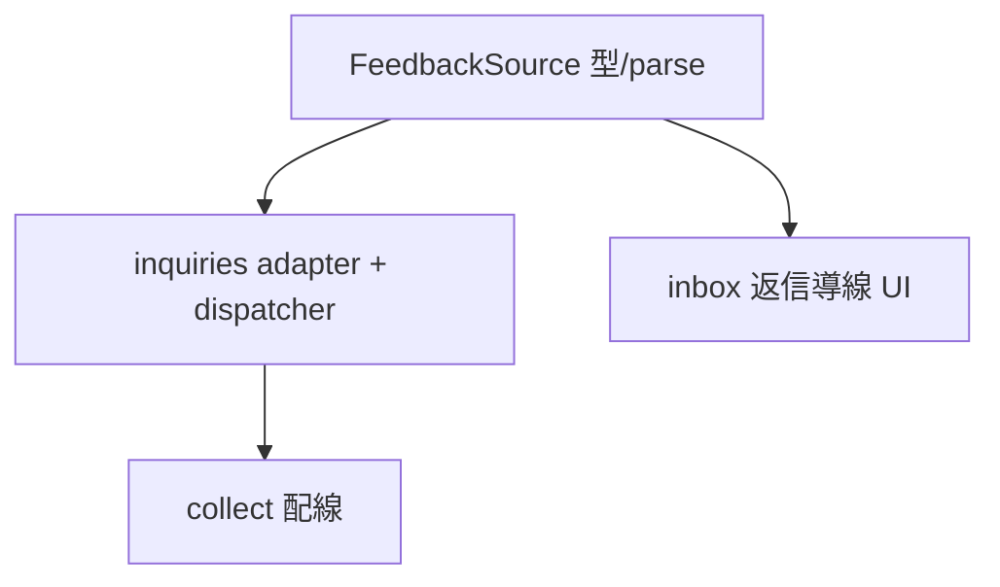

# feedback-inbox 変更計画書（inquiries 消費で返信導線）

> **入力**: `./001_REVISE_SPEC.md`, Step 2 実装コード
> **最終更新**: 2026-06-19

---

## 1. 既存ファイル変更一覧

| ファイル | 変更内容 | リスク | 関連 § |
|---|---|---|---|
| `src/features/collection/feedbackSources.ts` | source 表現を `FeedbackSource = {slug,name,url,kind}` に拡張。`parseFeedbackSources` で `kind?` (既定 feedback、未知値 skip+warn) を解釈。`mergeFeedbackSources`/`loadFeedbackTargets` を FeedbackSource ベースに | 中 (型変更、registered は kind=feedback でラップ) | §7.1 |
| `src/providers/feedback.ts` | `fetchFromSource(src, deps)` dispatcher を追加 (kind=feedback→既存 fetchFeedback / kind=inquiries→新 fetchInquiries)。既存 `fetchFeedback(ServiceDescriptor)` は維持 (registered 用) | 中 | §7.1/7.2 |
| `src/features/collection/feedbackRunner.ts` | `loadServices`/`fetchFeedback` を FeedbackSource ジェネリックに (svc.slug 参照は維持) | 低 | §7.1 |
| `api/admin/collect.ts` / `api/cron/collect.ts` | `runFeedbackCollection` に `fetchFromSource` を配線 (kind 別 dispatch) | 低 | §7.1 |
| `src/features/feedback-inbox/FeedbackInboxView.tsx` | item に `context.email` → mailto 返信リンク、`context.adminUrl` → 「shipyard で返信」リンク (該当時のみ、Clerk ゲート内) | 低 (additive) | §7.1 UC-reply |

## 2. 新規ファイル一覧

| ファイル | 責務 | 依存 | LOC 見積 |
|---|---|---|---|
| `src/providers/inquiries.ts` | `fetchInquiries(src, deps)` — `/api/hub/inquiries` を pull → FeedbackItemRow[] (context.email/adminUrl/subject、threadToken 破棄)。safeFetch + 検証 | safeFetch, types, safeUrl | ~90 |
| `src/providers/inquiries.test.ts` | 上記単体テスト | vitest | ~110 |

## 3. 削除ファイル一覧
| ファイル | 削除理由 | 代替 |
|---|---|---|
| (なし) | additive | — |

## 4. マイグレーション要否
- DB スキーマ変更: ❌ (email/adminUrl/subject は既存 context jsonb)
- 既存データ変換: ❌ / 設定ファイル変更: ✅ (`HUB_FEEDBACK_SOURCES` に kind 追記、.env.example 系) / ストレージパス変更: ❌

→ **005_REVISE_MIGRATION 不要**。

## 5. 実装 Phase 分割

### Phase 1: FeedbackSource 型 + parse 拡張
- 対象: `feedbackSources.ts` に kind 追加、merge/loadFeedbackTargets を FeedbackSource ベースに
- ゴール: kind 解釈 (既定 feedback / 未知 skip) + registered ラップ + dedup を単体担保

### Phase 2: inquiries adapter + dispatcher
- 対象: `src/providers/inquiries.ts` (fetchInquiries) + `feedback.ts` の `fetchFromSource` dispatcher
- ゴール: inquiries shape parse → context.email/adminUrl/subject、threadToken 破棄、401/404/badschema skip

### Phase 3: 配線 + inbox 返信導線
- 対象: collect 配線 (fetchFromSource) + FeedbackInboxView の返信リンク
- ゴール: kind=inquiries で email/adminUrl 取り込み、inbox に mailto / shipyard リンク表示

## 6. 依存関係順序

## 7. ロールアウト計画
| ステップ | 内容 | 検証 |
|---|---|---|
| 1 | コード改修デプロイ (22nd) | unit + E2E green |
| 2 | `HUB_FEEDBACK_SOURCES` の shipyard エントリに `"kind":"inquiries"` 追加 | 「今すぐ pull」→ inbox に返信導線表示 |

## 8. リスク・注意点
- inquiries の `email` は PII。Clerk ゲート内 inbox のみ表示、ログ/公開面に出さない。
- threadToken を誤って context に入れない (SEC-002、検証で明示破棄)。
- adminUrl は外部リンク → `rel="noopener noreferrer"` + isSafePublicUrl 検証。

## 9. 完了の定義 (DoD)
- [ ] 全 Phase 完了
- [ ] 単体: source kind / inquiries parse (email/adminUrl/subject/threadToken 破棄) / 返信導線 green + 回帰なし
- [ ] E2E: inquiries 取り込み → 返信リンク表示 / 標準ソース回帰 green
- [ ] マイグレーション: 該当なし
- [ ] `.env.example` 系に kind 例追記
- [ ] `/flow:secure` で email PII at rest を accepted maintain

## 10. 更新履歴
| 日付 | 変更概要 | 実行者 |
|---|---|---|
| 2026-06-19 | 初版作成 | /flow:revise |
